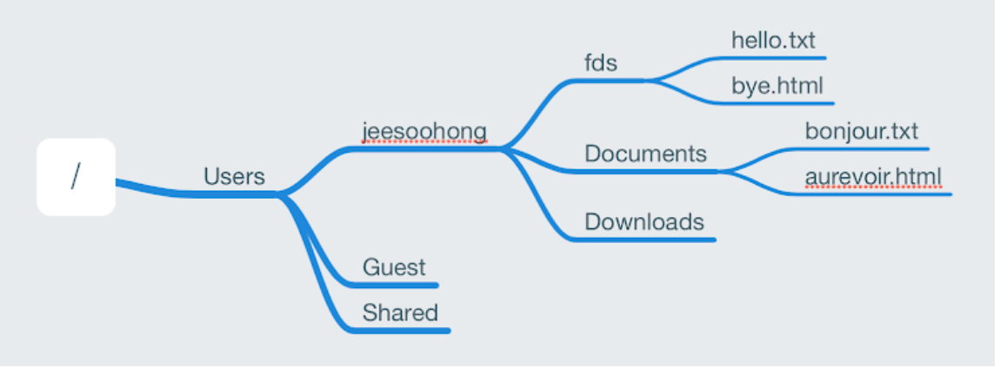
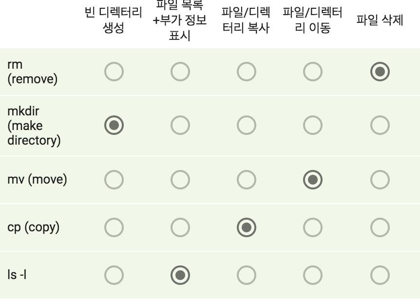

1. CLI 명령어 중, .(온점)은 현재 작업 디렉터리를 의미

2. fds일 때, Document로 이동하는 명령어

    

  - cd ~/Documents
  - cd /Users/jeesoohong/Documents

3. Documents 폴더 아래 bonjour.txt 파일의 내용전체를 보려면 어떤 명령을 사용하면 되는지(현재 작업 디텍터리는 fds) 

    

  - cat ../Documents/bonjour.txt
  - cat ../Documents/bonjour.txt

4. CLI 명령어 

    

5. Markdown은 문서화를 간편하게 도와주는 언어,프로그래밍 생태계에서 널리 사용

6. 사람이 보기 좋은 글꼴은 글자마다 고유의 폭을 따르는 가변 폭 글꼴이지만, 개발을 할 때는 주로 고정 폭 글꼴을 사용한다.

7. Markdown 문서 안에서는 자유롭게 HTML 문법을 쓸 수 있다. 다만 렌더링 환경에 따라 일부 문법은 지원되지 않는다.

8. 버번 관리 시스템은 시간에 따른 코드의 변화를 체계적으로 관리하는 소프트웨어이며, 소스코드를 안전하게 관리, 보관하기 위해 필요

9. 저장소에 필요한 뼈대 파일(Skeleton)이 들어 있는 .git 디렉터리가 하위에 생성되는 명령은 git `init` 이다.

10. Git은 Working directory,Staging area, repository 총 세 개의 영역을 관리한다.

11. Commit
  - 스테이징 영역에 올라온 변경사항을 영구히 보관하는 것을 의미
  - 여러 파일에 대한 변경사항을 하나로 묶어주는 단위로도 이해할 수 있다.
  - 실제 저장되는  정보는 변경사항이지 파일이 아니다.
  - 메시지와 함께 commit을 하려면 git commit -m "commit message" 와 같이 입력하면 된다.
  - 시간 순으로 저장되며, 과거 변경 이력과 내용르 거슬러 올라가면서 알 수 있다.

12. Github
  - 클라우드 형태로 Git저장고를 제공하는 서비스
  - 웹 브라우저를 통해 관리할 수 있더 편리
  - 다른 사람들과의 협업에 필요한 기능인 Issue,Project 등이 있어 편리
  - Github에서 생긴 변경사항은 git pull 명령을 한 후에 로컬 저장소에 반영
  - 어떤 프로젝트에 관심이 있는지, 코딩 스타일이 어떤지 등을 살펴볼 수 있어 개발자의 명함 같은 역할을 하기도 한다.

13. 과거에 비해 용량이나 속도가 훨씬 발전하였으나, 여전히 오늘날의 컴퓨터도 다양한 종류의 데이터(문자,숫자등)를 2진수로 변환하여 처리

14. 1비트는 0과 1 두 가지의 경우의 수를 가리키며, 1바이트는 8비트 즉 256가지의 경우의 수를 의미

15. 저급 프로그래밍 언어란 사람이 이해하기 쉽게 작성된 프로그매밍 언어로, 가독성이 높고 다루기 간단하여 고급 프로그래밍 언어보다 낮춰서 평가

16. 주 기억 장치는 수치 등을 계산하고 명령을 수행하는 등의 활동을 하는 RAM등을 의미, 용량이 작은 주 기억 장치를 확장한 보조 기억 장치는 속도가 느리며 용량이 상대적으로 크다.

17. RAM(Random Access Memory)는 빠르고 비싸며, 용량이 작고 휘발성이라는 특징을 가진다.