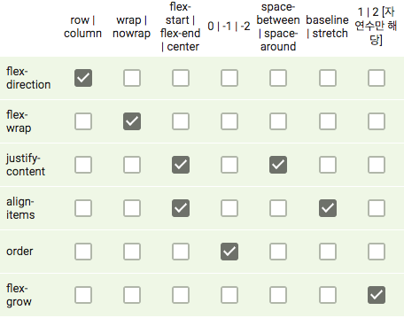

1. 특정 기능이 지원되지 않는 브라우저 상에서 기능을 구현하는 코드
- polyfill

2. block 요소를 가로 방향으로 가운데 정렬을 하기 위해 사용하는 방법 중 하나는 요소에 width 값을 준 후, marign: 0 auto; 를 주는 것이다.

3. `sticky`는 position 속성 중 상대적 위치에 자리하다가 뷰포트상 특정 위치에 도달하면 위치가 고정되는 값이다. relative와 fixed의 특성을 모두 보여주지만, 아직 브라우저 호환성이 부족

4. float를 clear하는 방법
- float 된 엘리먼트가 부모 엘리먼트의 높이에 영향을 주지 않기 때문에, float된 자식 요소의 높이를 부모 요소에 반영하기 위한 방법을 의미
- 부모 요소에 가상 선택자를 다음과 같이 추가하는 방법을 쓴다
  ```
  ::after {
    contetn: "";
    display: block;
    clear: both;
  }
  ```
- overflow: hidden;을 추가하는 방법도 있다.
- overflow: auto;를 추가하기도 한다.

5. WAI-ARIA를 이용하면 `<div>` 같은 태그에 role이나 aria-label등의 속성을 부여하여 웹 접근성을 개선할 수 있다.

6. margin에 대한 설명
- 음수 값을 사용할 수 있다.
- 박스모델 간 마진이 겹치는 부분에 병합이 일어나는 마진병합현상이 발생
- 상하좌우 중 한 쪽 방향에만 속성을 적용
- border-box인 경우 border와 padding이 width값에 포함되지만, margin은 포함되지 않는다.

7. postion 속성이 static이 아닐 때 가지는 특징
- top,bottom,left,right 속성을 사용
- position 속성을 적용시킨 대상은 block 요소가 된다.
- position: absolute 속성은 부모를 기준으로 움직인다.
- position: relative 속성은 자신의 static 포지션일 때의 위치를 기준으로 움직인다.
- position: fixed 속성은 브라우저의 화면을 기준으로 움직인다.

8. z-index 양수,음수 모두 적용이 가능하다.

9. 스크린리더 사용자를 위해 키보드 접근성을 고려하기 위한 목적이나 탭 순서를 변경하고 싶은 경우 등 탭 키의 접근 순서를 변경할 수 있는 속성
- tabindex

10. flex와 관련된 속성과 값

    

11. CSS에서 position 속성 중 fixed는 문서 흐름을 완전히 벗어나 뷰포트를 기준으로 상대 위치에 배치된다.

12. float속성이 적용되면, 해당 요소는 자도으로 block요소가 된다.

13. 기본적으로 block요소는 페이지 내에서 새로운 레이아웃 블록을 생성하고,양 옆에 다른 요소를 가질 수 없다.

14. 선택자에 대한 설명
- *는 전체 요소를 선택하는 것을 뜻한다.
- 속성 선택자는 []를 이용한다.(ex.a[href="#"]{})
- 자식요소를 선택하기 위해서는 > 를 사용한다.(ex.#main > div{})
- 클래스 선택자를 아무리 많이 더하여 사용해도, ID선택자보다 우선할 수는 없다.