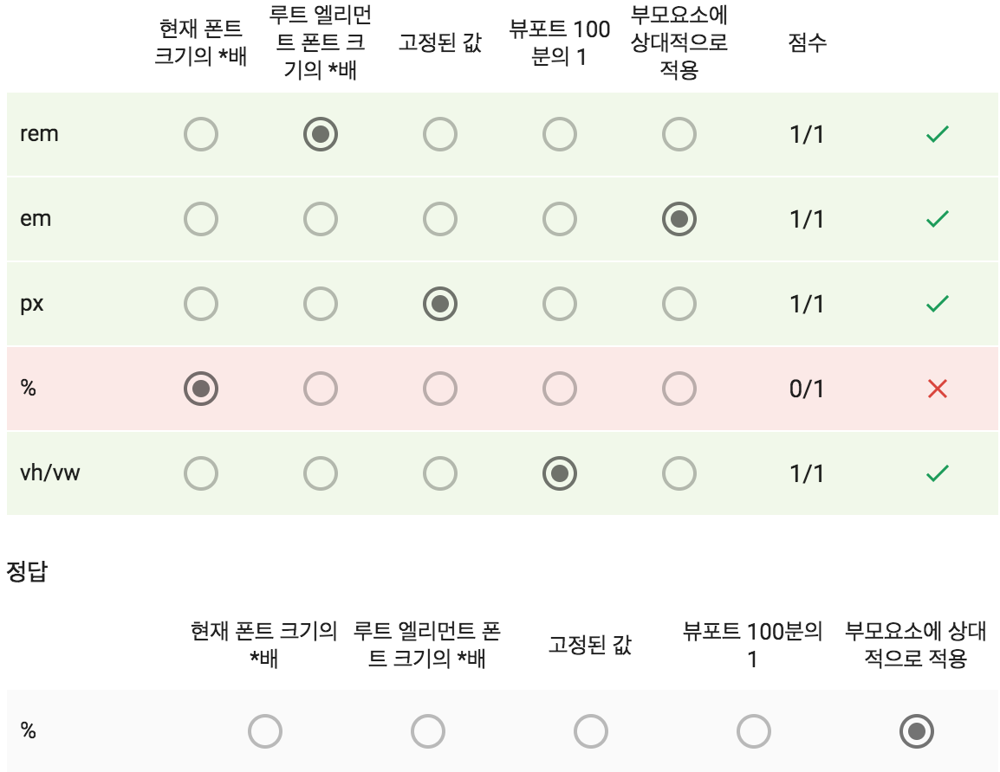
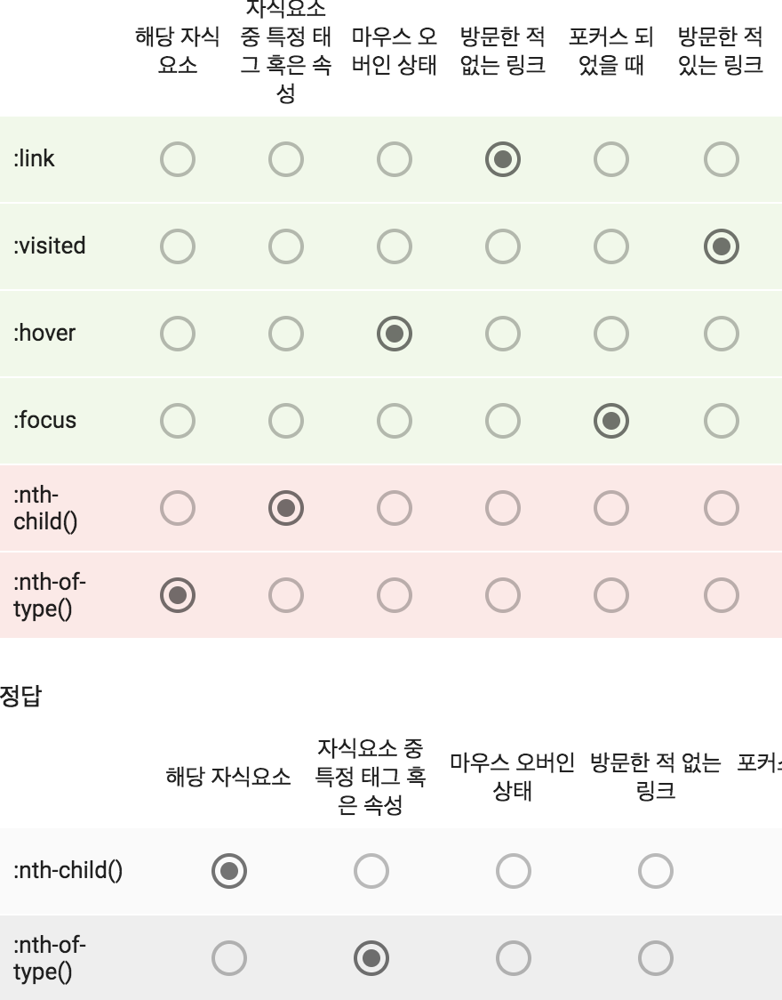

1. blockㅇ요소는 inline과 inline-block,block요소를 포함하지만, inline요소는 block요소를 포함할 수 없다.

2. Noramlize.css
- 브라우저 간의 에이전ㅌ 스타일 오차를 줄이거나 버그를 최소하하가 위해서 스타일을 재지정 혹은 통리하는 역할
- 오픈소스 프로젝트로 관리되고 있으므로 누구나 이슈를 리포트하거나 패치를 제출
- Reset.css와는 다르게 속성을 완전히 초기화하는 것이 아니라 필요한 부분만을 보정
- IOS에서 발행하는 폰트 이슈를 수정하는 버전이 따로 삽입되어 있다.

3. CSS normalize와 reset에 대한 설명
- Reset은 모든 기본 브라우저 스타일을 제거
- Normalize는 유용한 기본 스타일을 보존
- Normalize.css는 Bootstrap에 사용되기도 했다.
- 두가지를 함께 사용할 수도 있다.

4. 단축 속성
- 단축 속성은 동시에 여러 다른 CSS속성값을 설정하게 하는 CSS속성
- font는 단축 속성으로 적을 때 size와 family를 꼭 포함해야 한다.
- font-size보다 font-style, font-variant, font-weight가 무조건 앞에 나와야 한다.
- font-family가 가장 마지막에 적혀야 한다.
- {font:italic bold 16px/1.5 "Noto Sans", sans-serif;}라고 기재했을 때 이상 없이 속성이 잘 반영된다.

5. 웹 폰트는 로컬 컴퓨터에 폰드가 설치되어 있지 않아도 서버에서 바로 다운로드 받아 렌더링을 하므로 편리하나, 용량이나 깜빡이 현상 등의 이슈가 있다.

6. 부모 요소의 margin, padding, border는 자식에게 상속되지 않는다.컨테이너 관련 속성은 상속되지 않음

7. block 요소: h,section inline 요소: a,button,img,span

8. '상속'이라는 뜻의 CSS용어로, 자식 요소에 부모 요소가 가진 속성을 그대로 적용하라는 단어
- inherit

9. 단위

    

10. 가상 선택자와 관련한 설명

    

11. CSS 코드에 대한 설명
    ```
    p.top a {
      color: red;
    }
    ```
- top 라는 클래스명을 가진 paragraph 요소의 링크를 붉은색으로 지정한다.

12. CSS의 상속과 관련
- 상위 엘리먼크의 속성의 하위 엘리먼크가 물려 받는 것
- border 속성은 자동으로 상속되지 않는다.

13. CSS 코드에 대한 설명
    ```
    {font-family: 'Noto Sans', Arial, serif;}
    ```
- Noto Sans 폰트를 쓸 수 없는 상황에선 대신 Arial 폰트가 출력된다.
- Arial도 설치되어 있지 않으면 serif계열의 브라우저 지정 폰트로 출력된다.

14. 외부의 CSS파일을 가져오는 방법 
- 하나는 link, 다른 하나는 @import
- link는 html의 head 태그 안에서, @import는 CSS파일내에서 사용
- link는 빈 요소이므로 종료 태그가 없어도 괜찮다.