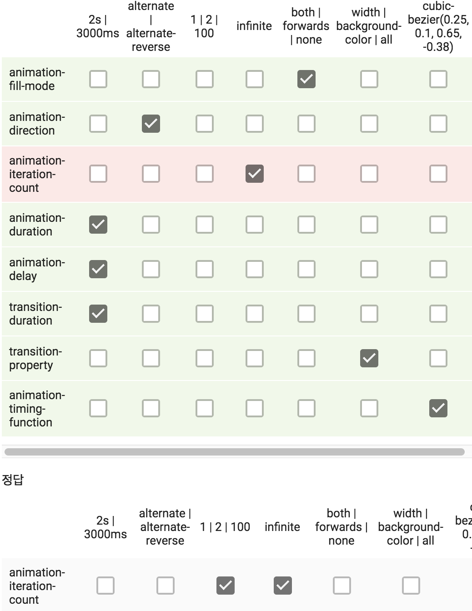

1. CSS background 잘못표시 예
- {background: scroll #92ab1f url("../images/flower.png")contain/center no-repeat;}
- 1) ~ 는 루트 디렉토리를 의미하며, 틀린 부분은 없습니다. (세미콜론이 빠져 있는 실수가 있었습니다!) 2) https://devdocs.io/css/background-attachment 3) 이미지를 2개 이상 사용할 수 있습니다. 겹쳐서 보이게 됩니다. 4) background 단축 표기 시, 다른 속성은 상관 없지만 `background-position` 과 `background-size` 의 위치는 무조건 position 이 size 보다 먼저 나와야 합니다. 두 개 속성은 슬래시(/)로 구분합니다. 5) gradient는 background-color가 아니라 background-image에 속하는 속성입니다. background 단축표기법으로도 기재할 수 있습니다.

2. background-position에서 pixel 값과 퍼센트 값은 이미지 위치 동작 방식이 같다.

3. CSS color 속성에서 투명도를 조정

4. opacity는 박스 속성 채로 수정, 내용만 투명도를 조절하기를 원한다면, color 속성에서 조절해야 한다.

5. animation/transition 관련 속성
  
6. inline과 inline-blocl의 차이
- inline 아이템은 vertical-align을 적용할 수 있지만 inline-block은 불가능

7. display: none을 준 요소는 스크린 리더가 읽을 수 없다.

8. {background-image: url("../lizard.png"), url("../star.png");}
- 두 이미지가 겹쳐서 표시되고 lizard.png가 star.png위로 올라온다.

9. background-position 설명
- background-position: top; 이미지의 top을 백그라운드 영역의 top에 위ㅣ치시키고 가로 값은 center이다.
- background-position: 0% 0%;은 background-position: left top; 과 같은 위치
- backgoround-position: 10% 40%;는 background-position: right 90% bottom 60%;와 같은 위치
- background-position: top top;은 invalid 이므로 무시

10. line-height 음수 값을 넣으면 무시